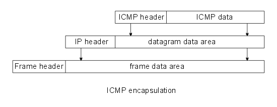

# 網路通訊協定


### ICMP

```
『網際控制訊息協定』（Internet Control Message Protocol）
```
### IEEE 802
```
https://zh.wikipedia.org/wiki/IEEE_802
```
```
IEEE 802中定義的服務和協定限定在OSI模型的最低兩層（即實體層和資料鏈路層）。

IEEE 802將OSI的資料鏈路層分為兩個子層:

Layer-2: 資料鏈路層===>  邏輯鏈路控制（LLC, Logical Link Control）
                媒介存取控制（MAC, Media Access Control）
Layer-1: 實體層
```
```
IEEE 802.1：高層區域網路協定（Bridging (networking) and Network Management）
IEEE 802.2：邏輯鏈路控制（Logical link control）

區域網路用的協定:
(超級重要)IEEE 802.3：乙太網路（Ethernet）
IEEE 802.4：權杖匯流排（Token bus）
IEEE 802.5：權杖環（Token-Ring）

IEEE 802.6：城域網（MAN, Metropolitan Area Network）
IEEE 802.7：寬頻TAG（Broadband LAN using Coaxial Cable）
IEEE 802.8：光纖分散式資料介面（FDDI）
IEEE 802.9：綜合業務區域網路（Integrated Services LAN）
IEEE 802.10：區域網路網路安全（Interoperable LAN Security）
(超級重要)IEEE 802.11：無線區域網路（Wireless LAN & Mesh）
IEEE 802.12：需求優先級（Demand priority）
IEEE 802.13：（未使用）
IEEE 802.14：電纜數據機（Cable modems）
IEEE 802.15：無線個人區域網路（Wireless PAN）
  IEEE 802.15.1：無線個人區域網路絡（WPAN, Wireless Personal Area Network）
  IEEE 802.15.4：低速無線個人區域網路絡（LR-WPAN, Low Rate Wireless Personal Area Network）
IEEE 802.16：寬頻無線接入（Broadband Wireless Access）
IEEE 802.17：彈性封包環傳輸技術（Resilient packet ring）
IEEE 802.18：無線電管制技術（Radio Regulatory TAG）
IEEE 802.19：共存標籤（Coexistence TAG）
IEEE 802.20：移動寬頻無線接入（Mobile Broadband Wireless Access）
IEEE 802.21：媒介獨立換手（Media Independent Handover）
IEEE 802.22：無線區域網（Wireless Regional Area Network）
IEEE 802.23：緊急服務工作群組（Emergency Services Working Group）

```
### ARP


### ICMP Message Format封包格式:


```
ICMP 封包格式，其各欄位功能如下：

● 訊息型態（Message Type）：表示該 ICMP 所欲控制之訊息型態，共有 13 種型態，訊息型態之型態代表值如表 4-2 所示。

● 編碼（Code）：對各種訊息型態進一步說明工作內容。

● 檢查集檢查碼（Checksum）：對該封包檢查集錯誤偵測。

● 訊息說明（Message description）：依照不同的控制訊息，而有不同的說明方式。
```

### ICMP 封裝



```


```

### ICMP常用指令
```


```


###


